# 🚀 Project Title

OmniHealth: Smart Health Disease Predictor & Baymax Health Assistant

## 📝 Overview

OmniHealth is a comprehensive web application that serves as a smart health disease predictor and includes a health assistant named Baymax. The project aims to provide users with an intuitive platform for predicting various diseases based on symptoms and diagnostic tests. Additionally, Baymax offers personalized health assistance and guidance to users.

## 🎨 Features

- Disease prediction for Malaria, Alzheimer's, Kidney Disease, Heart Diseases, Diabetes, and Pneumonia.
  

    
     
    
  

- Interactive user interface with symptom selection and diagnostic input.
- Visual representation of disease information using images and text.
- Integration with machine learning models for accurate predictions.
- Baymax Health Assistant for personalized health guidance and assistance.

## 🛠️ Getting Started

### Screnshots
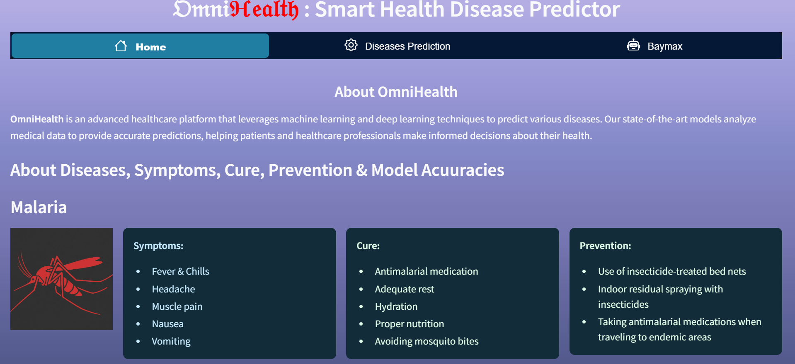
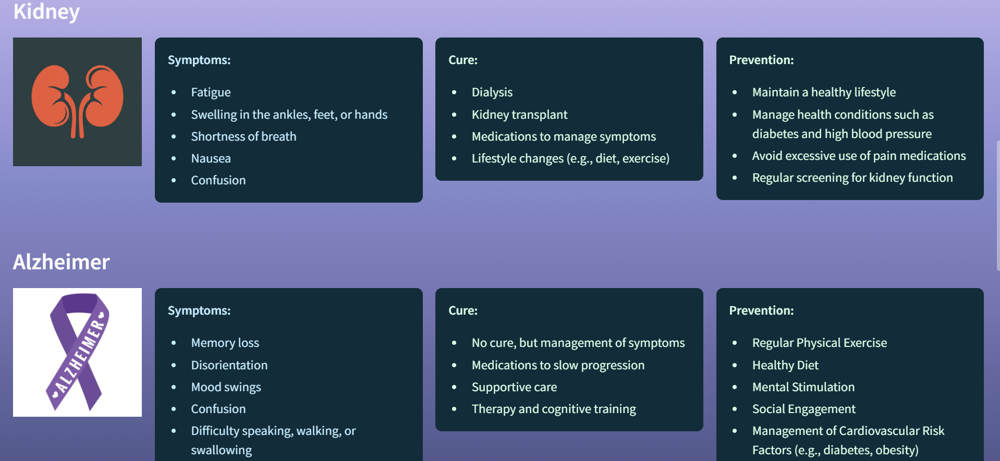
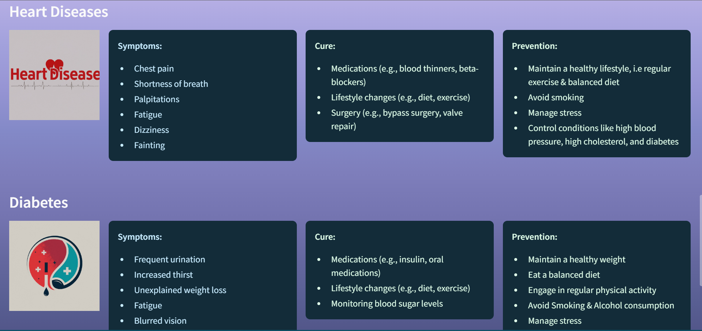
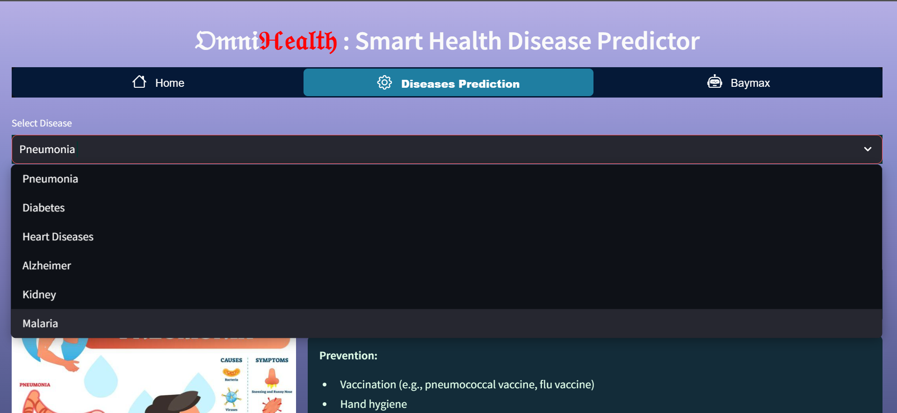
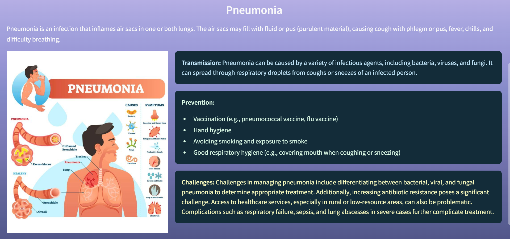
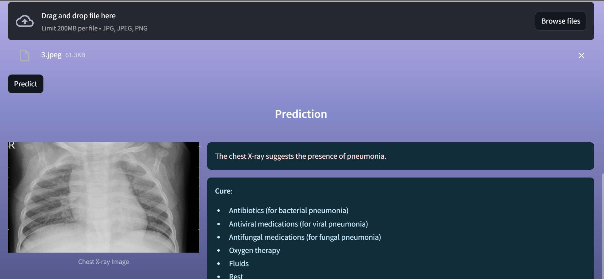
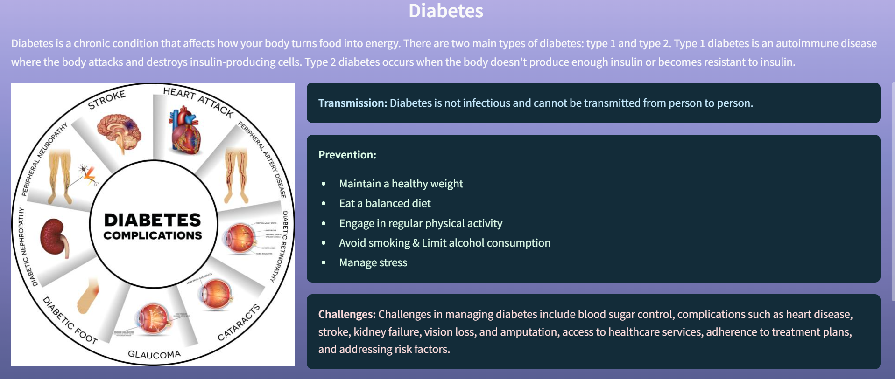
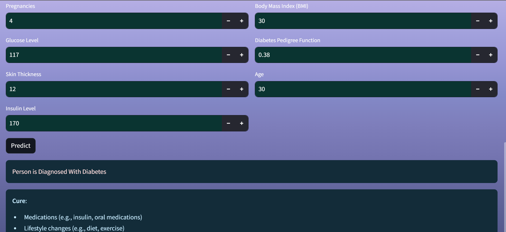
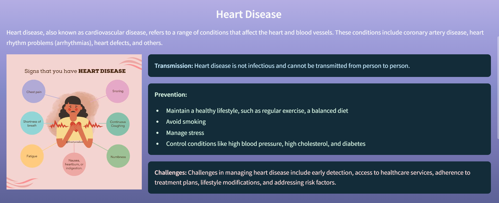
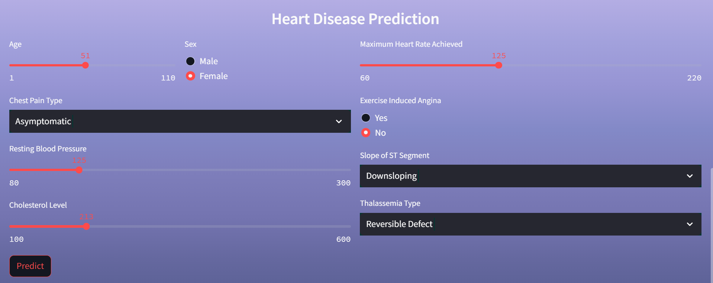
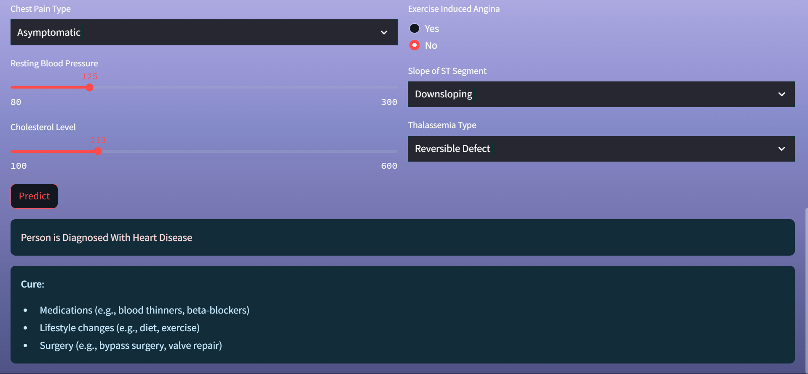
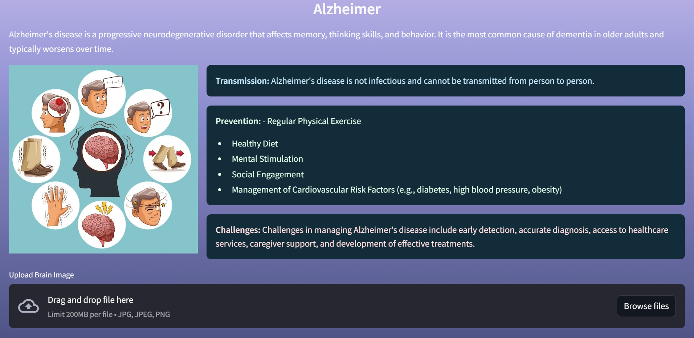
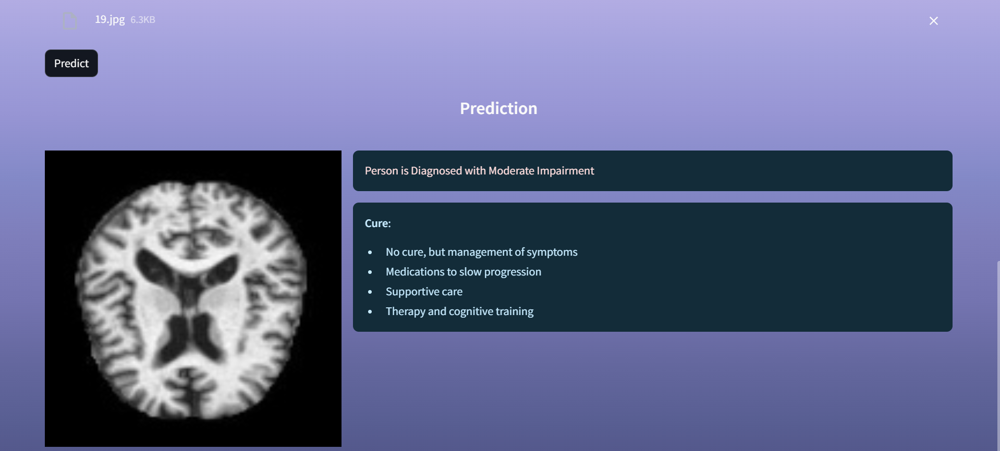
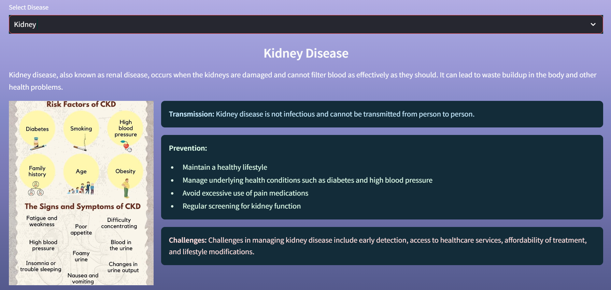
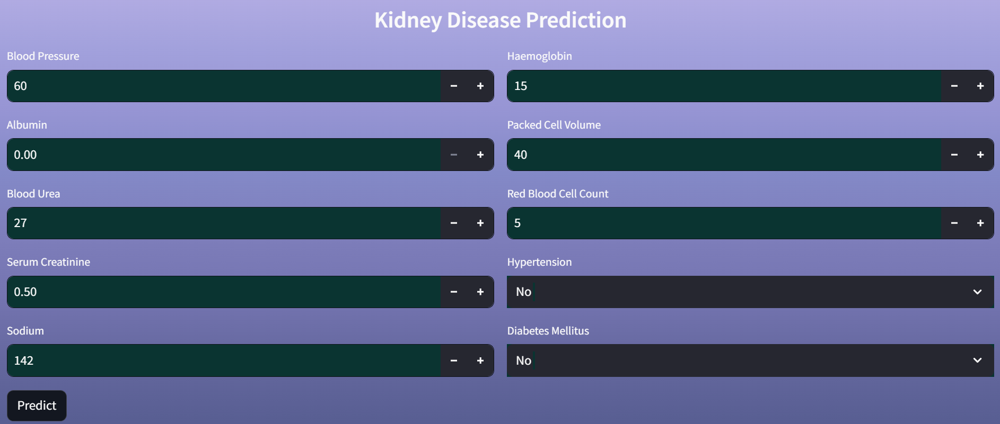
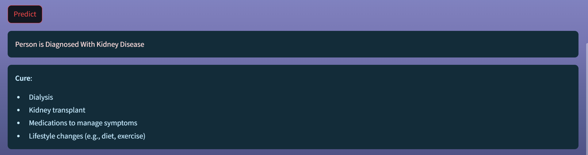
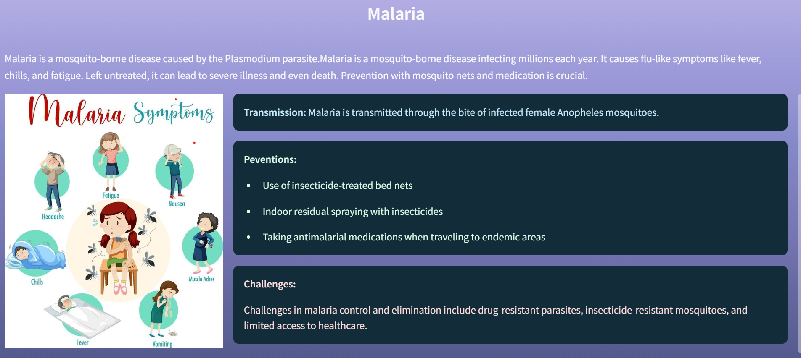
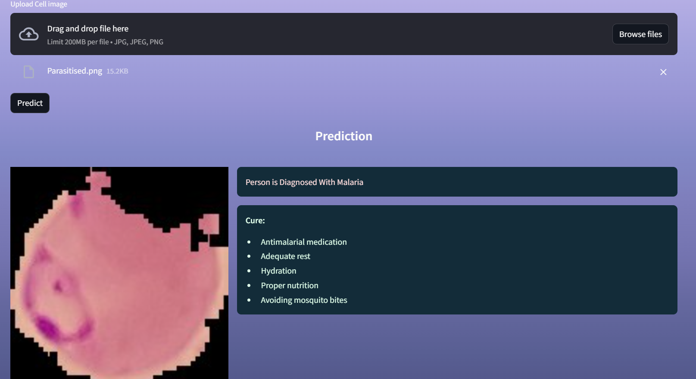
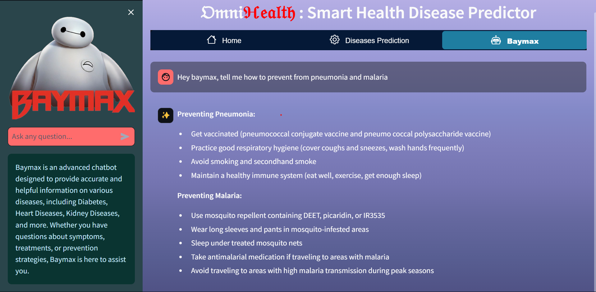

## 📋 Usage

1. Select a disease from the dropdown menu.
2. Follow the instructions to upload relevant diagnostic images or input diagnostic data.
3. Click the "Predict" button to get the prediction results.
4. View the prediction outcome and recommended treatments.
5. Access Baymax Health Assistant for personalized health advice and assistance.

## 🤝 Contributing
Contributions are welcome! Please fork the repository and create a pull request with your changes.
